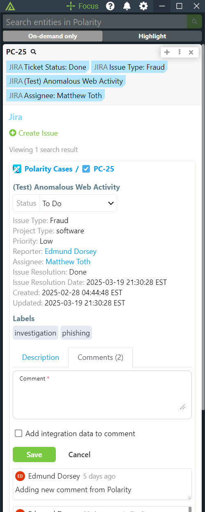
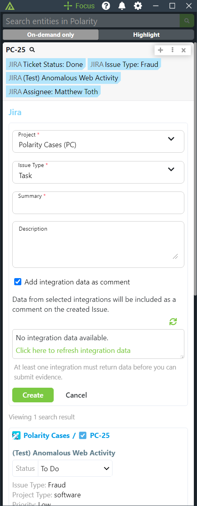

# Polarity Jira Integration

The Polarity Jira integration allows Polarity to search Jira to return any Issues that are contained in Jira.

The integration supports Jira Cloud as well as Jira Server v8.16+

|                   |  | |
|--------------------------------------------|-------------------------------|-------------------------------|
| *Lookup and Search Issues* | *Add Comments*        | *Create Issues*

## Authentication

If you are authenticating to Jira Server v8.16+ then you should only provide an API Token.  For user's authenticating to Jira Cloud, a username and corresponding API token for that user are required.

## Adding Integration Data to Issues

This integration supports adding integration data to existing and newly created Jira issues.  The integration data is added as a comment.  Due to limits on the size of a Jira comment, integration data may be truncated and/or split across multiple comments.  

## Jira Integration Options

### Jira Base URL

URL used to access your instance of Jira.

### Jira UserName

Username used for individual to access Jira.  The Username is not required if you are authenticating to Jira Server.  Jira Server authentication is done via API Token only.

### API Token or Password

Jira API token.  Required for both Jira Cloud and Jira Server.

https://id.atlassian.com/manage/api-tokens

### Ignored Entities List
A comma delimited list entities you wish to ignore from search

### Ignore Regex Entities List',
A comma delimited list regular expressions for ignoring entities from search

### Projects to Search

A comma delimited list of project names to search. Project short names can be used in addition to the long names. Project names are not case-sensitive. If no value is provided, all accessible projects will be searched. This setting does not affect searches on Jira Issue Keys and is only used for searches on other entities (e.g., IP, domain, cve, etc.).

### Enable Updating Issue Status
If enabled, users will be able to update the issue status of an issue. Users will only be able to update status if they have the appropriate permissions in Jira based on the configured Jira Email Address and/or API Token.

### Enable Adding Comments
If enabled, users will be able to add comments to issues. Users will only be able to add comments if they have the appropriate permissions in Jira based on the configured Jira Email Address and/or API Token.

### Enable Creating Issues
If enabled, users will be able to create new Jira issues. Users will only be able to create issues if they have the appropriate permissions in Jira based on the configured Jira Email Address and/or API Token.

Valid options are:

1. Disabled -- Users cannot create issues
2. Enabled -- Creating Jira issues is available when Jira search results exist
3. Enabled - Creating Jira issues is always available

## Installation Instructions

Installation instructions for integrations are provided on the [PolarityIO GitHub Page](https://polarityio.github.io/).

## Polarity

Polarity is a memory-augmentation platform that improves and accelerates analyst decision making.  For more information about the Polarity platform please see:

https://polarity.io/
